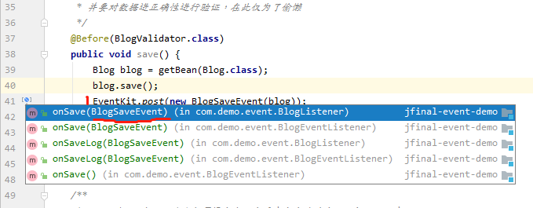
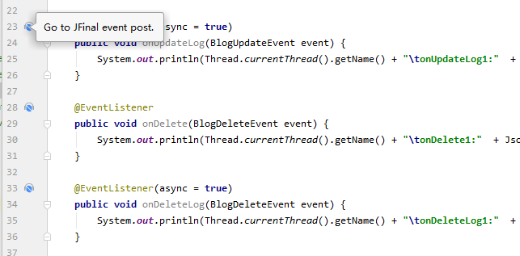

# JFinal event idea 插件

## 功能
1. Event post 和监听器的标记。
2. Event post 和监听器的跳转。

## 效果

## 鸣谢
**由衷感谢**参与此次 `JFinal-event` **Idea 插件众筹**的伙伴们。

## 众筹详情
| 昵称         | 金额              |
| ------------ | ----------------- |
| LINQI        | ￥20              |
| LastB7       | ￥10              |
| 杜福忠兄弟们 | ￥80              |
| 小续         | ￥100             |
| Jfinal 用户zhangqi | ￥100       |
| jfinal使用者问号？ | ￥20        |
| *哥          | ￥18              |
| 山东小木     | ￥100             |
| CrazyAirhead | ￥100             |
| 合计：       | ￥548             |

**活动详情** 请见：https://jfinal.com/share/1973
